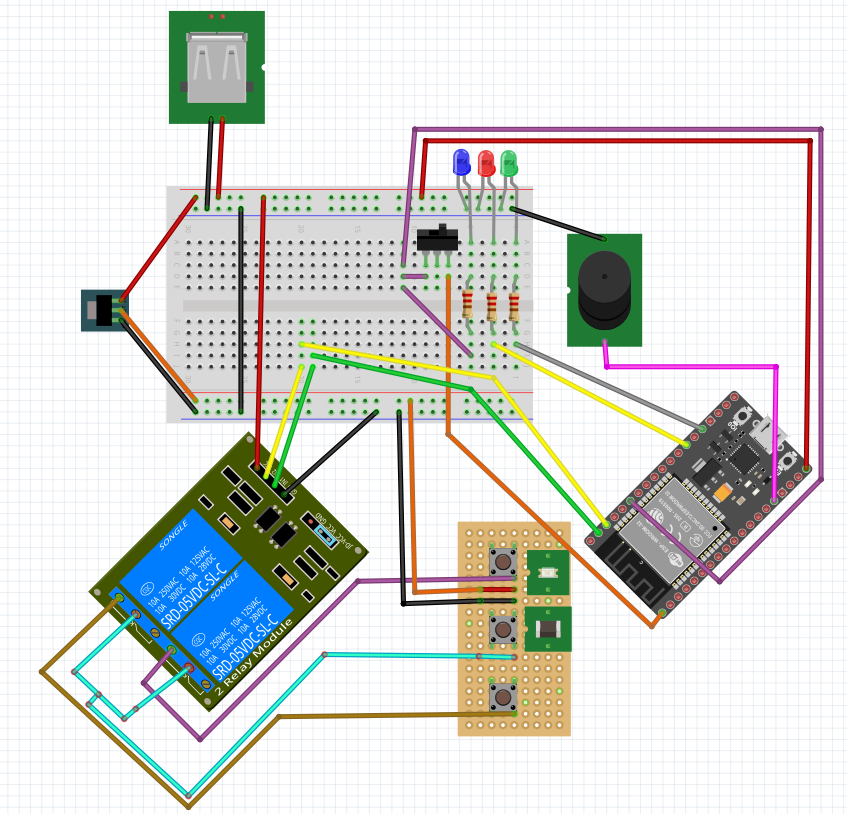
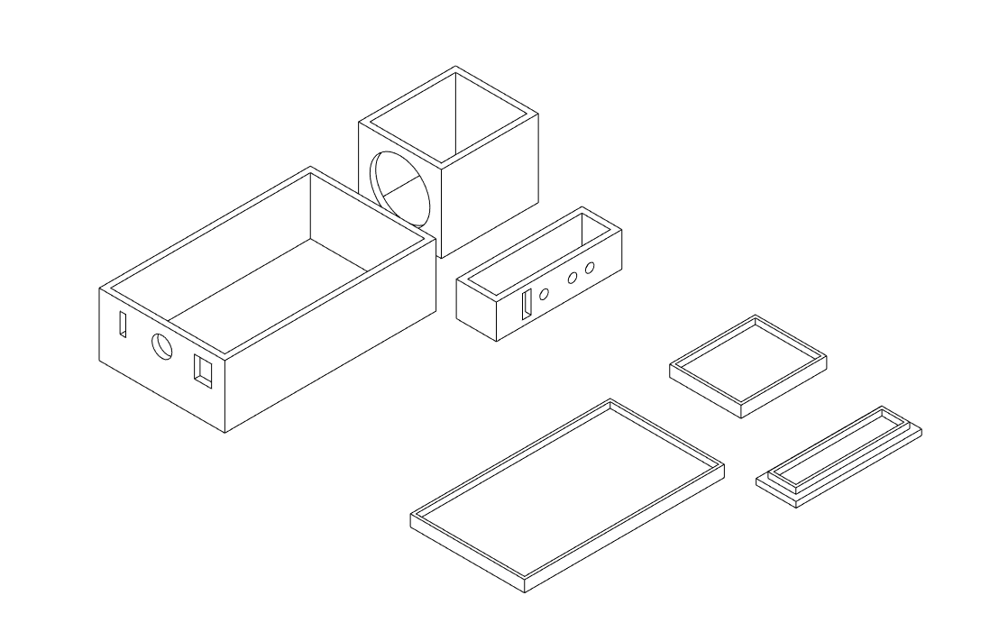
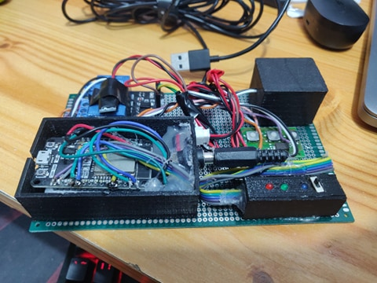
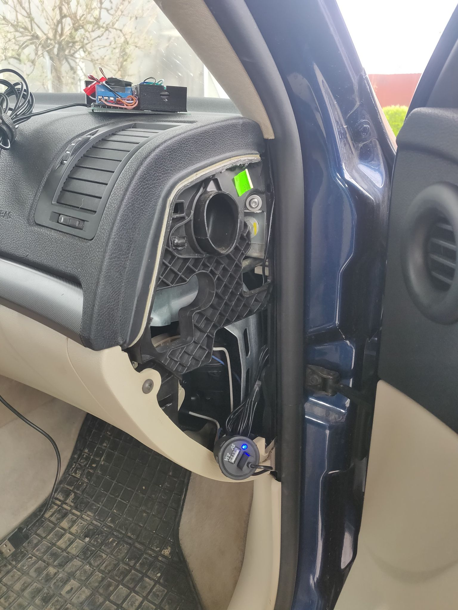
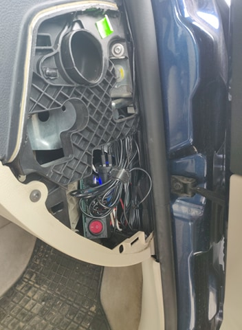
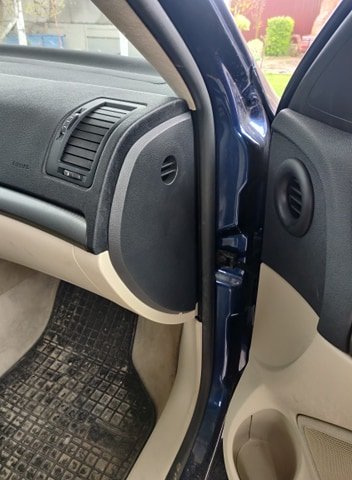

## Automatic car unlock when nearby

 
 The main issue which this application solves is human forgetfulness, specifically if the car door 
 was locked or not. From my own experience, happens around 40% of the time, that I do not remember it.

 Basic idea is to have a BLE device (a phone, or a smartwatch/fitbit) and when that device is near the car,
the door will open, when it is not in range anymore, the doors will lock automatically.

## How it works?

 The application is configured to search for a specific MAC Address, since they are unique it is considered
secure but there also can be other security features introduced, for example that the device has to be paired
or by implementing a handshake. 

 The configuration part should be done over bluetooth, with a BL serial connection. With this feature, we
don't have to worry about changing our watch/phone, because the app only has to be reconfigured, 
 not reprogrammed.

## Pre-requisites

  - ESP 32-WROOM
  - A relay with 2 separate circuits
  - A remote car key motherboard
  - A BLE device (Android phone/Smartwatch/Fitbit)
  - 3 LED-s with 220 Ohm resistors
  - A 2-way switch
  - A buzzer
  - A DC-to-DC 5v-3.3v converter

## Schematics

### Why use relays?

If we look closely, we can see that we have 2 circuits here. The one which contains the ESP-32
and the one which contains the key motherboard. For safety purposes I made it like this, so we won't
burn the key component, which is the most expensive part of the project and also the one which we have no
schematics or information about it whatsoever. 

## Wiring

### Power connections
 - 5v - ESP IN
 - GND - ESP GND
 - 5v - DC-DC converter input
 - GND - DC-DC converter GND
 - DC-DC output - Key input (where normally the battery goes)
 - GND - Key GND (where normally the battery goes)

### ESP Connections:
 - GPIO 13 - Buzzer
 - GPIO 2 - Green LED (turns on for 1 second when the car is unlocked)
 - GPIO 4 - Red LED (turns on for 1 second when the car is locked)
 - 3.3V - Switch input
 - GPIO 13 - Switch output
 - GPIO 22 - Switch output
 - GPIO 23 - Relay IN-1
 - GPIO 22 - Relay IN-2

 ### Relay connections:
 - COM1 & COM2 - Key common (it can be found with a multimeter, 
   all buttons on the key have that connection in common)
 - NO1 - Key close button's leg 
 - NO2 - Key open button's leg

## 3D Models

### Final status

## Set up

 - Write the software onto the hardware using Arduino IDE
 - Download `Serial Bluetooth Terminal` from the [google play store](https://play.google.com/store/apps/details?id=de.kai_morich.serial_bluetooth_terminal&hl=en&gl=US)
 - Turn the switch on the ESP on and pair with the ESP (The name is set through the code)
- Send the following text to the device: 
  `|aa:bb:aa:bb:aa:bb;3500;5200;1100;4750;3;1000|`
     - The first is the mac address of the BLE device which is used as key
     - Second is the open delay (how much to wait after a scan whilst unlocked)
     - Third is the open timeout (how much to wait after the car was unlocked)
     - Fourth is the closed delay (how much to wait after a scan whilst locked)
     - Fifth is the closed timeout (how much to wait after the car was locked)
     - Sixth is the not found in a row (how many scans to wait to close the car if key not found)
     - Seventh is how much time to "press" the buttons on the key (different for each key)

## Putting it in the car 
  Please don't mind the fact that I haven't cleaned the interior in a while

  
  
  

## Demo

- [Open](https://drive.google.com/file/d/1vdPQ3_-kpQKyuDBrLKMNAIiMtcbKEesC/view?usp=sharing)
- [Close](https://drive.google.com/file/d/1vZy_R_4CrWvbVkuXrSSYAppPH0XH2bDy/view?usp=sharing)
